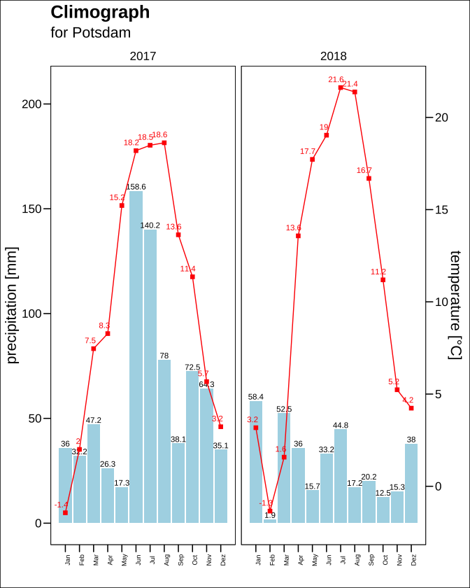

dwdaccess, version 0.0.1
================
Friedemann Brockmeyer

<!-- README.md is generated from README.Rmd. Please edit that file -->

## Disclaimer

I am a Statistician with a passion for sensor data and open data
projects. While I have designed and assembled my own weather station (on
the basis of the *Raspberry Pi 3*), I also dealt with open data
availability of weather data in Germany. A few initial efforts are shown
below.

> This site is not intended to share my code - mostly written in
> *python*, *mySQL*, and *R* - to operate my weather station, and to \>
> save my data on a self-hosted server. At least for the moment.

## Data

As of September 28, 2023, the weather and climate data for Germany can
be found at the [open data
server](https://opendata.dwd.de/climate_environment/CDC/) provided by
[“Deutscher Wetterdienst”](https://www.dwd.de/EN/Home/home_node.html),
commonly abbreviated as *DWD*.

To access relevant data conveniently, we wrapped simple functions in a
tiny package called `{dwdaccess}`. The usage will be demonstrated by
telling a little story originated from a trivial conversation I had with
a friend at a lake on a hot summer day in August 2023.

> There exist other *R* packages to handle data from DWD like
> [“rdwd”](https://bookdown.org/brry/rdwd/). Those are beyond the scope
> \> of this project.

## Installation

One can install the development version of `{dwdaccess}` from
[GitHub](https://github.com/FBrockmeyer/dwdaccess) with:

``` r
if(!require(devtools)) install.packages("devtools")
devtools::install_github("FBrockmeyer/dwdaccess")
library(dwdaccess)
```

The development of a full and competitive package available via CRAN is
not planned yet.

## Example: *A tropical night*

The lake we met at was the famous
[Wannsee](https://www.openstreetmap.org/search?query=Wannsee#map=12/52.4341/13.1992).
To retrieve the latitude and longitude coordinates of any location we
wrote a function `address_to_lonlat()` which translates any character
string like `"Wannsee Berlin"` to a numeric vector containing longitude
and latitude coordinates. To do so, the function relies on an API
service from [Open Street Map](https://www.openstreetmap.org/). With
*RStudio*’s viewer we can display the locations on a variety of maps.
Particularly interesting for the development of a *shiny app* (TODO).

``` r
{
  library(leaflet)
  library(leaflegend)
}

kladow <- address_to_lonlat("Kladow Berlin")

leaflet() |>
  addTiles() |>
  flyTo(lng = kladow["longitude"],
        lat = kladow["latitude"], 
        zoom = 11) |>
  addMiniMap(width = 150L, height = 150L)
```

> The output from the *code chunk* above cannot be presented on github,
> since support for *java*-driven applications like *leaflet* \> is
> missing. Come back later to see an update.

Besides the location of interest, we need the locations of all weather
stations operated and affiliated by DWD to identify relevant stations
close by. The function `dwd_stations()` returns a list of weather
stations. The list is on-line available, click
[here](https://opendata.dwd.de/climate_environment/CDC/observations_germany/climate/daily/kl/recent/KL_Tageswerte_Beschreibung_Stationen.txt).
Finally, with `distance_between()` we are able to calculate the distance
between the inserted location, *Kladow*, a village situated on the lake,
and the nearest weather stations in meters:

``` r
distance_between(stations = dwd_stations(),
                 location = address_to_lonlat(address = "Kladow Berlin")) |>
                 # everything from here on is for styling purposes only
  head() |> 
  kable(col.names = c("id", "start_date", "end_date", "stations_height", "name", "geometry", "distance")) 
```

|     | id    | start_date | end_date | stations_height | name              | geometry                |        distance |
|:----|:------|:-----------|:---------|----------------:|:------------------|:------------------------|----------------:|
| 113 | 00435 | 19640101   | 20061231 |              45 | Berlin-Zehlendorf | POINT (13.2327 52.4289) |  7184.398 \[m\] |
| 563 | 02621 | 19560101   | 19691231 |              42 | Kleinmachnow      | POINT (13.2134 52.4045) |  7950.801 \[m\] |
| 849 | 03988 | 18930101   | 20191231 |              81 | Potsdam           | POINT (13.0622 52.3822) | 10162.401 \[m\] |
| 848 | 03987 | 18930101   | 20230921 |              81 | Potsdam           | POINT (13.0622 52.3812) | 10257.607 \[m\] |
| 95  | 00402 | 18760101   | 19621231 |              55 | Berlin-Dahlem     | POINT (13.2997 52.4564) | 10825.689 \[m\] |
| 96  | 00403 | 19500101   | 20230921 |              51 | Berlin-Dahlem     | POINT (13.3017 52.4537) | 10977.383 \[m\] |

<!-- https://bookdown.org/yihui/rmarkdown-cookbook/kable.html -->

> Throughout this introduction the commands `kable()` and, later,
> `t() |> kable()` are used to style the output. `kable()` is exported
> from package
> [`{knitr}`](https://bookdown.org/yihui/rmarkdown-cookbook/kable.html).

The wrapper `zip_urls()` scraps the information found under links of
[this
form](https://opendata.dwd.de/climate_environment/CDC/observations_germany/climate/hourly/air_temperature/recent/),
e.g.

``` r
recent_temp <- zip_urls(
  link = "https://opendata.dwd.de/climate_environment/CDC/observations_germany/climate/hourly/air_temperature/recent/") 
historical_temp <- zip_urls(
  link = "https://opendata.dwd.de/climate_environment/CDC/observations_germany/climate/hourly/air_temperature/historical/")
```

and is mainly designed to collect all links to available *.zip*-files. A
link for each station/id. The function is not restricted to data on an
hourly basis. It works with [other time intervals between
measurements](https://opendata.dwd.de/climate_environment/CDC/observations_germany/climate/)
as well. Let’s store the `id`s of the five closest weather stations (A)
and check if data, i.e., links to *.zip*-files, are indeed available
(B):

``` r
# (A)
nearest5stations <- distance_between(stations = dwd_stations(),
                                     location = address_to_lonlat(address = "Kladow Berlin")
                                     )$Stations_id[1L:5L]
# (B)
recent_temp[recent_temp$id %in% nearest5stations, ] |> kable()
```

|     | url                                                                                                                                        | id    |
|:----|:-------------------------------------------------------------------------------------------------------------------------------------------|:------|
| 296 | <https://opendata.dwd.de/climate_environment/CDC/observations_germany/climate/hourly/air_temperature/recent/stundenwerte_TU_03987_akt.zip> | 03987 |

``` r
historical_temp[historical_temp$id %in% nearest5stations, ] |> kable()
```

|     | url                                                                                                                                                               | id    |
|:----|:------------------------------------------------------------------------------------------------------------------------------------------------------------------|:------|
| 379 | <https://opendata.dwd.de/climate_environment/CDC/observations_germany/climate/hourly/air_temperature/historical/stundenwerte_TU_03987_18930101_20221231_hist.zip> | 03987 |

It looks like the station with `id` $03987$ is the only out of the five
closest stations providing data. Does the data for recent and historical
records come from the same station?

``` r
recent_temp[recent_temp$id %in% nearest5stations, ]$id == 
  historical_temp[historical_temp$id %in% nearest5stations, ]$id
```

    ## [1] TRUE

Yes. Which station name corresponds to the `id`?

``` r
dwd_stations()[
  which(dwd_stations()$Stations_id == recent_temp[recent_temp$id %in% nearest5stations, ]$id), ] |>
  kable(col.names = c("id", "start_date", "end_date", "stations_height", "name", "geometry", "distance")) 
```

|     | id    | start_date | end_date | stations_height |    name | geometry | distance |
|:----|:------|:-----------|:---------|----------------:|--------:|---------:|:---------|
| 848 | 03987 | 18930101   | 20230921 |              81 | 52.3812 |  13.0622 | Potsdam  |

The weather station on the grounds of the *University of Potsdam* it is,
click
[here](https://www.openstreetmap.org/search?whereami=1&query=52.38124%2C13.06212#map=19/52.38124/13.06212)
to see the location. As we have now identified potential data, we
continue with the download of recent (air) temperature (and humidity)
data on an hourly basis. Additionally, we download all historical data
that is available.

> A thorough documentation can be found
> [here](https://opendata.dwd.de/climate_environment/CDC/observations_germany/climate/hourly/air_temperature/).
> A complete list of available variables can be obtained from
> [here](https://opendata.dwd.de/climate_environment/CDC/observations_germany/climate/hourly/).
> We assume that the download function `download_data()` can also be
> used for other sub folders than *air_temperature* and *precipitation*.

The below code demonstrates the utilisation of `download_data()` to
access data from a certain weather station. The function can also be
used to download data from several stations at once. For this, the input
data frame `job` needs to contain several station ids. After the
download process is complete, we use several `{data.table}` functions to
rename and modify the data in the fastest possible manner. You can
ignore the surrounding if-clause and its purposes.

``` r
# Code in if-clause runs only once per R session. This is intended behaviour.
if(exists("hasRun") == FALSE) {
  # Download weather data 
  recent_data <- download_data(
    job = recent_temp[recent_temp$id %in% nearest5stations, ],
    cleanup = TRUE)
  historical_data <- download_data(
    job = historical_temp[historical_temp$id %in% nearest5stations, ],
    cleanup = TRUE)
  # Modify and rename 
  {
    library(data.table)
  }
  data <- data.table::merge.data.table(x = data.table::setDT(recent_data),
                                       y = data.table::setDT(historical_data), 
                                       all = TRUE)
  # Clean-up environment 
  rm(recent_data, historical_data)
  # Renaming
  data <- setNames(object = data, 
                   nm = c("id", "datetime", "quality9", 
                          "temperature", "humidity", "eor"))
  # Change character variable containing date information to POSIXct (datetime)
  data[, datetime := as.POSIXct(x = as.character(datetime), 
                            format = "%Y%m%d%H", 
                            origin = Sys.timezone())]
  # Pad id with zeros; nchar == 5
  data[, id := sprintf("%05s", id)]
  # Replace missing values with R-like NA's
  for(col in names(data)) data.table::set(data, 
                                          i = which(data[[col]] == -999.000), 
                                          j = col, 
                                          value = NA)
  hasRun <- TRUE 
}
```

    Disk clean-up: The directory /Users/cara/Desktop/dwdaccess/temp_folder has been deleted.Disk clean-up: The directory /Users/cara/Desktop/dwdaccess/temp_folder has been deleted.

The data is now downloaded, merged and prepared in a very *R*-like
fashion. The time has come to do simple explanatory analysis. How many
observations and variables did we get?

``` r
dim(data) |> kable()
```

|       x |
|--------:|
| 1145866 |
|       6 |

More than a million observations, and six variables, distributed over

``` r
difftime(
  time1 = max(data$datetime, na.rm = TRUE), 
  time2 = min(data$datetime, na.rm = TRUE), 
  tz = Sys.timezone(), units = "days") |> kable()
```

| x             |
|:--------------|
| 47749.87 days |

roughly $130.71$ years. That is the number of days $47,7743.87$ divided
by $365.25$. Similarly relevant is the share of observations with
non-missing (air) temperature values:

``` r
sum(complete.cases(data$temperature)) / nrow(data) 
```

    ## [1] 0.9999799

This figure is impressively high.

Coming back to the trivial conversation. We spoke about the extreme heat
during these days in the middle of August 2023. One mentioned: “We have
a **tropical night**.”. *Meteorologists* define those as **nights where
the lowest (air) temperature between 6 p.m. and 6 a.m. does not fall
under 20°C**. By the way, (air) temperature is commonly measured at a
height of two meters above sea level, see, e.g. the [DWD
documentation](https://opendata.dwd.de/climate_environment/CDC/observations_germany/climate/hourly/air_temperature/DESCRIPTION_obsgermany_climate_hourly_air_temperature_en.pdf).
We would now like to know whether he was correct in stating that.

To increase comprehensibility, we switch to `{dplyr}` syntax. Although
(moderately) slower in big data applications, it is more widely used in
applied science than `{data.table}`. First, we calculate a few more
variables `year`, `month`, and `date` to simplify filtering (1). Second,
we store the data under the name `example` to reduce length of code in
subsequent `code chunks` (2). We, then, *subset* the data to get the
relevant month: August 2023 (3). Essentially, we calculate an indicator
variable [`tn20GT`](https://en.wikipedia.org/wiki/Tropical_night) which
is `TRUE` if a certain night meets the definition and `FALSE` otherwise
(4).

``` r
library(dplyr); library(lubridate)
# (1) + (2)
example <- data |>
  mutate(year = lubridate::year(datetime),
         month = lubridate::month(datetime), 
         date = lubridate::date(datetime)) 
# (3)
example |>
  filter(year == 2023L & 
           datetime >= as.POSIXct("2023073118", format = "%Y%m%d%H", origin = Sys.timezone()) & 
           datetime <= as.POSIXct("2023083106", format = "%Y%m%d%H", origin = Sys.timezone())
         ) |>
# (4)
  # shifted time ranges 
  mutate(shifted_start = lubridate::as_date(datetime - lubridate::hours(18))) |>
  summarise(tn20GT = all(temperature >= 20L), .by = shifted_start) |>
  count(tn20GT) |> kable()
```

| tn20GT |   n |
|:-------|----:|
| FALSE  |  30 |
| TRUE   |   1 |

For each day, to decide whether or not a night was tropical the routine
considers the previous night instead of the upcoming one. This is a
matter of definition. As a consequence, $6$ hours of July 31, 2023 need
to be taken into account. Similarly, the filtering ends on 2023-08-31
06:00:00, meaning August 31, 2023 at 6 a.m., such that the (air)
temperatures on the last evening of August 2023 are ignored as those
only influence the calculation w.r.t. September 1, 2023. Which night was
tropical?

``` r
example |>
  filter(year == 2023L & 
           # read "2023073118" as 6 p.m. on July 30, 2023 
           datetime >= as.POSIXct("2023073118", format = "%Y%m%d%H", origin = Sys.timezone()) & 
           datetime <= as.POSIXct("2023083106", format = "%Y%m%d%H", origin = Sys.timezone())
         ) |>
  mutate(shifted_start = lubridate::as_date(datetime - lubridate::hours(18))) |>
  summarise(tn20GT = all(temperature >= 20L), .by = shifted_start) |>
  filter(tn20GT == 1L) |> kable()
```

| shifted_start | tn20GT |
|:--------------|:-------|
| 2023-08-19    | TRUE   |

> `shifted_start` is an auxiliary variable, created to calculate
> `tn20GT`, and slightly misleading in terms of interpretation. Due to
> the shift, we need to add one day to the date under `shifted_start`:

``` r
example |>
  filter(year == 2023L & 
           datetime >= as.POSIXct("2023081918", format = "%Y%m%d%H", origin = Sys.timezone()) & 
           datetime <= as.POSIXct("2023082006", format = "%Y%m%d%H", origin = Sys.timezone())
         ) |> 
  select(id, datetime, temperature, humidity) |>
  kable()
```

| id    | datetime            | temperature | humidity |
|:------|:--------------------|------------:|---------:|
| 03987 | 2023-08-19 18:00:00 |        26.9 |       68 |
| 03987 | 2023-08-19 19:00:00 |        26.5 |       63 |
| 03987 | 2023-08-19 20:00:00 |        25.6 |       68 |
| 03987 | 2023-08-19 21:00:00 |        24.7 |       72 |
| 03987 | 2023-08-19 22:00:00 |        24.5 |       71 |
| 03987 | 2023-08-19 23:00:00 |        24.4 |       73 |
| 03987 | 2023-08-20 00:00:00 |        23.6 |       74 |
| 03987 | 2023-08-20 01:00:00 |        23.1 |       82 |
| 03987 | 2023-08-20 02:00:00 |        22.7 |       84 |
| 03987 | 2023-08-20 03:00:00 |        22.0 |       88 |
| 03987 | 2023-08-20 04:00:00 |        21.3 |       92 |
| 03987 | 2023-08-20 05:00:00 |        21.0 |       91 |
| 03987 | 2023-08-20 06:00:00 |        20.9 |       80 |

All records between $6$ p.m. and $6$ a.m. are greater than $20°C$.
**Therefore, the night previous to the day August 20, 2023 was tropical.
He was right.**

The [German version](https://de.wikipedia.org/wiki/Tropennacht) of the
Wikipedia article “*Tropical night*” is interesting. Among other things,
it is explained that the [weather station of the Meteorological
Institute (LMU) in
Munich](https://www.meteorologie.lmu.de/ueber_uns/kontakt/index.html)
recorded a yearly average of $1.7$ *tropical nights* between 1982 and
2002. Worrisome, between 2003 and 2018 this number increased to $5.25$.
Unequal periods of time, $20$ and $15$ years as well as the selection of
the starting years appear questionable and need to be investigated.
Scientifically unsound at first glance. However, the following code
calculates those numbers for the weather station located in *Potsdam*:

``` r
example |>
  filter(year %in% 1982L:2002L) |>
  mutate(shifted_start = lubridate::as_date(datetime - lubridate::hours(18L))) |>
  summarise(tn20GT = all(temperature >= 20L), .by = c(shifted_start, year)) |>
  select(year, tn20GT) |>
  summarise(tn20GT_total = sum(tn20GT), .by = year) |> t() |> kable()
```

|              |      |      |      |      |      |      |      |      |      |      |      |      |      |      |      |      |      |      |      |      |      |
|:-------------|-----:|-----:|-----:|-----:|-----:|-----:|-----:|-----:|-----:|-----:|-----:|-----:|-----:|-----:|-----:|-----:|-----:|-----:|-----:|-----:|-----:|
| year         | 1982 | 1983 | 1984 | 1985 | 1986 | 1987 | 1988 | 1989 | 1990 | 1991 | 1992 | 1993 | 1994 | 1995 | 1996 | 1997 | 1998 | 1999 | 2000 | 2001 | 2002 |
| tn20GT_total |    0 |    1 |    0 |    0 |    0 |    1 |    1 |    0 |    0 |    0 |    1 |    0 |    4 |    1 |    0 |    0 |    1 |    0 |    1 |    1 |    1 |

In total $13$ *tropical nights* are recorded, resulting in an average of
$\sim 0.62$ *tropical nights* per year between 1982 and 2002. 1994 is
striking with four occurrences. For the time period 2003-2018 the result
looks as follows:

``` r
example |>
  filter(year %in% 2003L:2018L) |>
  mutate(shifted_start = lubridate::as_date(datetime - lubridate::hours(18L))) |>
  summarise(tn20GT = all(temperature >= 20L), .by = c(shifted_start, year)) |>
  select(year, tn20GT) |>
  summarise(tn20GT_total = sum(tn20GT), .by = year) |> t() |> kable()
```

|              |      |      |      |      |      |      |      |      |      |      |      |      |      |      |      |      |
|:-------------|-----:|-----:|-----:|-----:|-----:|-----:|-----:|-----:|-----:|-----:|-----:|-----:|-----:|-----:|-----:|-----:|
| year         | 2003 | 2004 | 2005 | 2006 | 2007 | 2008 | 2009 | 2010 | 2011 | 2012 | 2013 | 2014 | 2015 | 2016 | 2017 | 2018 |
| tn20GT_total |    2 |    0 |    1 |    3 |    2 |    0 |    0 |    5 |    0 |    1 |    5 |    1 |    6 |    2 |    0 |    8 |

For this span of years, $36$ *tropical nights* are recorded. The
corresponding average is $2.25$. We observe eight *tropical nights* in
2018. My mother and grandmother regularly remind others of the heat in
1994. I wonder if they remember 2018 in the same way?

<div class="figure" style="text-align: center">


<p class="caption">
How the author escaped the heat in 1994.
</p>

</div>

What about the recent years?

``` r
example |>
  filter(year %in% 2019L:2023L) |>
  mutate(shifted_start = lubridate::as_date(datetime - lubridate::hours(18L))) |>
  summarise(tn20GT = all(temperature >= 20L), .by = c(shifted_start, year)) |>
  select(year, tn20GT) |>
  summarise(tn20GT_total = sum(tn20GT), .by = year) |> t() |> kable()
```

|              |      |      |      |      |      |
|:-------------|-----:|-----:|-----:|-----:|-----:|
| year         | 2019 | 2020 | 2021 | 2022 | 2023 |
| tn20GT_total |    5 |    5 |    3 |    7 |    2 |

The Wikipedia article I have mentioned earlier provides multiple
definitions:

- desert day $:= T_{max} \geq 35°C$,
- hot day $:= T_{max} \geq 30°C$,
- summer day $:= T_{max} \geq 25°C$,
- heating day $:= T_{med} < 12°C$,
- vegetation day $:= T_{med} \geq 5°C$,
- frosty day $:= T_{min} < 0°C$, and
- icy day $:= T_{max} < 0°C$, where

T $:=$ temperature, max $:=$ maximum, min $:=$ minimum, and med $:=$
median.

For the given span of years, the total amount of days per year falling
into each day category can be visualised:

``` r
library(sysfonts); library(showtext); library(ggplot2)
font_add_google("Fuzzy Bubbles")
showtext_auto()

example2 <- data |>
  mutate(year = lubridate::year(datetime),
         month = lubridate::month(datetime), 
         date = lubridate::date(datetime)) |> 
  select(-datetime) |> 
  summarise(max_temp = max(temperature, na.rm = TRUE), 
         min_temp = min(temperature, na.rm = TRUE), 
         med_temp = median(temperature, na.rm = TRUE),
         avg_temp = mean(temperature, na.rm = TRUE), 
         .by = c(date, year))

example2 |> 
  # https://de.wikipedia.org/wiki/Wüstentag_(Meteorologie)
  summarise(desert_day = sum(max_temp >= 35L, na.rm = TRUE), 
            hot_day = sum(max_temp >= 30L, na.rm = TRUE),
            summer_day = sum(max_temp >= 25L, na.rm = TRUE),
            heating_day = sum(med_temp < 12L, na.rm = TRUE),
            vegetation_day = sum(med_temp >= 5L, na.rm = TRUE),
            frosty_day = sum(min_temp < 0L, na.rm = TRUE),
            icy_day = sum(max_temp < 0L, na.rm = TRUE), 
            .by = year) |> 
  filter(!is.na(year)) |>
  tidyr::pivot_longer(cols = -year, 
                      names_to = "day", 
                      values_to = "count") |>
  
  ggplot(aes(y = count, x = year)) +
  geom_bar(stat = "identity") +
  geom_smooth(stat = "smooth", method = "loess", col = "red", 
              se = TRUE, na.rm = TRUE, linewidth = .5) +
  facet_wrap(~factor(day, levels = 
                       c("desert_day", "hot_day", "summer_day", 
                         "heating_day", "vegetation_day", 
                         "frosty_day", "icy_day")), 
             nrow = 3L, scales = "free") +
  scale_y_continuous(expand = c(0L, 0L)) +
  scale_x_continuous(breaks = seq(from = min(example2$year, na.rm = TRUE), 
                                  to = max(example2$year, na.rm = TRUE), 
                                  by = 10L), 
                     expand = c(0L, 0L)) +
  labs(main = "Yearly counts of days per category.", 
       x = "") +
  ggthemes::theme_base() + 
  theme(axis.text.x = element_text(angle = 90L, size = 7L), 
        text = element_text(family = "Fuzzy Bubbles"))
```


> Note, years with missing data cause white space inside the figures.

## Example: *On Precipitation*

**Please note. More explanation will be added with future versions.**

Until now, we only experimented with temperature data. We continue with
the download of rainfall (precipitation) data available by running the
same routine as before:

``` r
recent_rain <- zip_urls(
  link = 
    "https://opendata.dwd.de/climate_environment/CDC/observations_germany/climate/hourly/precipitation/recent/") 
historical_rain <- zip_urls(
  link = 
    "https://opendata.dwd.de/climate_environment/CDC/observations_germany/climate/hourly/precipitation/historical/")

## checks
# "03987" %in% recent_rain$id
# "03987" %in% historical_rain$id

if(exists("hasRun2") == FALSE) {
  recent_data <- download_data(
    job = recent_rain[recent_rain$id == "03987", ],
    cleanup = TRUE)
  historical_data <- download_data(
    job = historical_rain[historical_rain$id == "03987", ],
    cleanup = TRUE)
  {
    library(data.table)
  }
  rf <- data.table::merge.data.table(x = data.table::setDT(recent_data),
                                     y = data.table::setDT(historical_data), 
                                     all = TRUE)
  rm(recent_data, historical_data)
  
  # Renaming (modified)
  rf <- rf[, c("STATIONS_ID", "MESS_DATUM", "QN_8", "R1")]
  rf <- setNames(object = rf, 
                 nm = c("id", "datetime", 
                        "quality8", "precipitation"))
  rf[, datetime := as.POSIXct(x = as.character(datetime), 
                              format = "%Y%m%d%H", 
                              origin = Sys.timezone())]
  rf[, id := sprintf("%05s", id)]
  for(col in names(rf)) data.table::set(rf, 
                                        i = which(rf[[col]] == -999.000), 
                                        j = col, 
                                        value = NA)
  hasRun2 <- TRUE 
}
```

What did we get?

``` r
rf |> head() |> kable()
```

| id    | datetime            | quality8 | precipitation |
|:------|:--------------------|---------:|--------------:|
| 03987 | 1995-09-01 00:00:00 |        1 |           1.3 |
| 03987 | 1995-09-01 01:00:00 |        1 |           1.7 |
| 03987 | 1995-09-01 02:00:00 |        1 |           0.5 |
| 03987 | 1995-09-01 03:00:00 |        1 |           0.5 |
| 03987 | 1995-09-01 04:00:00 |        1 |           0.9 |
| 03987 | 1995-09-01 05:00:00 |        1 |           1.1 |

``` r
min(rf$datetime, na.rm = TRUE); max(rf$datetime, na.rm = TRUE)
```

    ## [1] "1995-09-01 CEST"

    ## [1] "2023-09-27 23:00:00 CEST"

``` r
dim(data) |> kable()
```

|       x |
|--------:|
| 1146010 |
|       6 |

Visualising the last ten years by means of *monthly accumulated
rainfall* (`monthly_rainfall`):

``` r
rf |>
  mutate(year = lubridate::year(datetime),
         month = lubridate::month(datetime)) |>
  select(-datetime) |> 
  summarise(monthly_rainfall = sum(precipitation, na.rm = TRUE), 
            .by = c(year, month)) |>
  filter(!is.na(year) & year %in% 2013L:2022L) |>
  
  ggplot(aes(x = month, y = monthly_rainfall)) +
  geom_bar(stat = "identity", fill = "lightblue") +
  facet_wrap(~factor(year, levels = 2022L:2013L), 
             scales = "free", ncol = 3L) +
  scale_x_continuous(breaks = 1L:12L,
                     labels = c('Jan', 'Feb', 'Mar', 
                                'Apr', 'May', 'Jun', 
                                'Jul', 'Aug', 'Sep', 
                                'Oct', 'Nov', 'Dez'), 
                     expand = c(0L, 0L)) +
  scale_y_continuous(expand = c(0L, 0L)) +
  labs(y = expression(paste("rainfall in ", frac(mm, month))),
       x = "") +
  ggthemes::theme_base() + 
  theme(axis.text.x = element_text(angle = 90L, size = 7L))
```


> Note. As there arise errors when
> `text = element_text(family = "Fuzzy Bubbles")` is added to `theme()`,
> this line is currently not used to style the figures with a fancy
> font.

Extracting the years with minimal and maximal amounts of *rainfall*:

``` r
rf |>
  mutate(year = lubridate::year(datetime),
         month = lubridate::month(datetime)) |>
  select(-datetime) |> 
  summarise(monthly_rainfall = sum(precipitation, na.rm = TRUE), 
            .by = c(year, month)) |>
  filter(!is.na(year) & year >= 2010L) |>
  summarise(yearly_rainfall = sum(monthly_rainfall), .by = year) |>
  arrange(desc(yearly_rainfall)) |> kable()
```

| year | yearly_rainfall |
|-----:|----------------:|
| 2017 |           745.8 |
| 2013 |           682.1 |
| 2010 |           647.8 |
| 2021 |           612.3 |
| 2012 |           606.5 |
| 2011 |           606.4 |
| 2015 |           565.4 |
| 2014 |           541.4 |
| 2019 |           540.3 |
| 2016 |           503.7 |
| 2020 |           498.7 |
| 2023 |           484.1 |
| 2022 |           404.5 |
| 2018 |           345.7 |

Interesting! The wettest year is followed by the most driest one.

### Arranging climograph for the most and less rainy years

Data handling: filtering and merging accordingly.

``` r
x <- rf |>
  mutate(year = lubridate::year(datetime),
         month = lubridate::month(datetime)) |>
  filter(year %in% 2017L:2018L)

y <- data |>
  mutate(year = lubridate::year(datetime),
         month = lubridate::month(datetime)) |>
  filter(year %in% 2017L:2018L)

xy <- data.table::merge.data.table(x = x[, -"quality8"], 
                                   y = y[, c("datetime", "temperature", "humidity")], 
                                   by = "datetime")
```

Build a plot with two y-axis: on the left *monthly amount of rainfall*,
and on the right *average monthly temperature*.

``` r
climograph_data <- 
  xy |>
  select(-datetime) |>
  summarise(monthly_rainfall = sum(precipitation, na.rm = TRUE),
            monthly_avg_temp = mean(temperature, na.rm = TRUE),
            .by = c(year, month)) 

ylim_1st <- c(0L, 220L)  
ylim_2nd <- c(-2L, 23L)  
b <- diff(ylim_1st) / diff(ylim_2nd)
a <- ylim_1st[[1L]] - b * ylim_2nd[[1L]]

climograph_data |>
  ggplot(aes(x = month, y = monthly_rainfall)) +
  geom_col(fill = "lightblue") +
  geom_text(aes(label = monthly_rainfall), vjust = -.25, size = 3L) +
  geom_point(aes(y = a + monthly_avg_temp * b), shape = 15L, col = "red", size = 2L) +
  geom_text(aes(y = a + monthly_avg_temp * b, label = round(x = monthly_avg_temp, digits = 1L)), 
            col = "red", size = 3L, hjust = .8, vjust = -1L) +
  geom_line(aes(y = a + monthly_avg_temp * b), col = "red") +
  facet_wrap(vars(factor(year))) +
  scale_y_continuous(name = "precipitation [mm]", 
                     sec.axis = sec_axis(~ (. - a) / b, name = "temperature [°C]")) +
  scale_x_continuous(breaks = 1L:12L,
                     labels = 
                       c('Jan', 'Feb', 'Mar', 'Apr', 'May', 'Jun', 
                         'Jul', 'Aug', 'Sep', 'Oct', 'Nov', 'Dez')) +
  labs(title = "Climograph", subtitle = "for Potsdam", x = "") +
  ggthemes::theme_base() + 
  theme(axis.text.x = element_text(angle = 90L, size = 7L))
```



> Note again. As there arise errors when
> `text = element_text(family = "Fuzzy Bubbles")` is added to `theme()`,
> this line is currently not used to style the figures with a fancy
> font.

More to come. Come back later.
